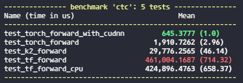
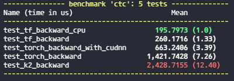

<h3 align="center">CTC Benchmark</h3>

---

<p align="center"> What's the best CTC implementation?
    <br>
</p>

## About <a name = "about"></a>
This project aims to benchmark the performance of some ctc algorithm implementations.

Currently include:
- [torch.nn.CTCLoss](https://pytorch.org/docs/stable/generated/torch.nn.CTCLoss.html)
- [tf.nn.ctc_loss](https://www.tensorflow.org/api_docs/python/tf/nn/ctc_loss)
- [k2.CtcLoss](https://k2-fsa.github.io/k2/python_api/api.html#ctc-loss)

## Getting Started <a name = "getting_started"></a>
```bash
pip install -r requirements.txt
```

## Running the benchmark tests <a name = "tests"></a>

```bash
# run ctc:forward (get ctc-loss) tests
pytest -k "forward" --benchmark-columns='mean' .
# run ctc:backward (calculate gradients) tests
pytest -k "backward" --benchmark-columns='mean' .
```


### Results
- ctc forward benchmark results


- ctc backward benchmark results



## Built Using <a name = "built_using"></a>
- [Pytest](https://github.com/pytest-dev/pytest) - Python Test Framework
- [Pytest-benchmark](https://github.com/ionelmc/pytest-benchmark/) - Benchmark Framework within Pytest
